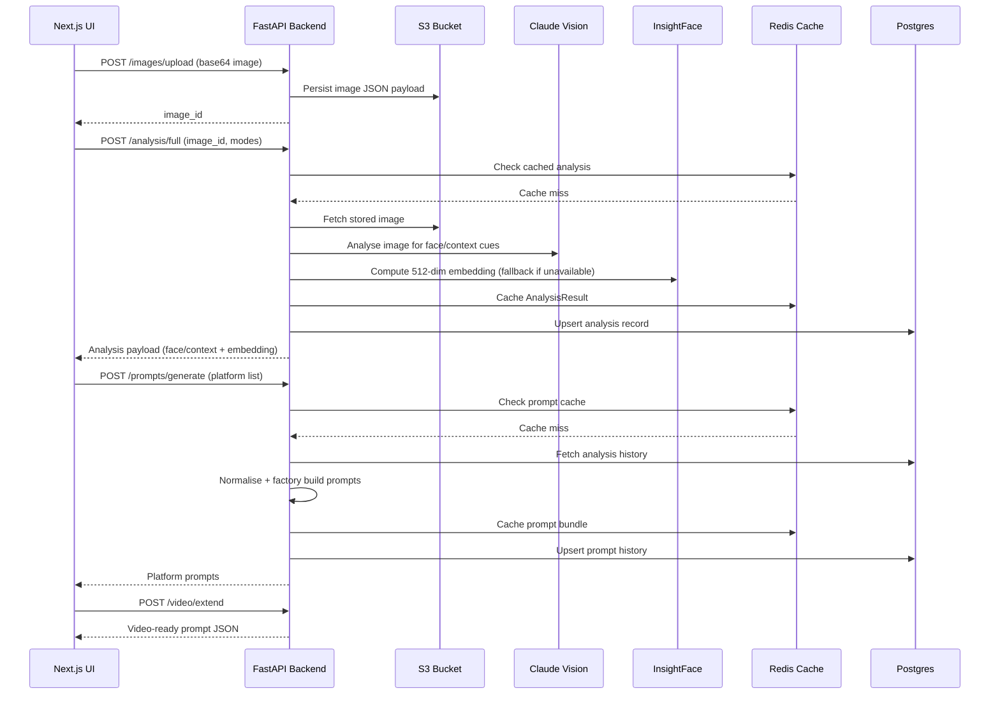

# Architecture Overview

## Backend
- **API Composition** – FastAPI routers (`images`, `analysis`, `prompts`, `video`) expose a clean boundary around the domain services.
- **Strategy Integrations** – `ImageAnalyzerService` fans out to Claude Vision, Florence, and LLaVA strategies (Claude is live; others act as enrichers). InsightFace powers the face detector when a model directory is supplied.
- **Pipeline Workflow** – `ImageProcessingPipeline` coordinates repository access, invokes analyzers, writes embeddings, and caches results.
- **Persistence Layer** – Hybrid repositories write to S3 (image payloads) and Postgres (`image_analysis`, `prompt_history`). Redis provides low-latency caching and stores face embeddings for reuse.
- **Prompt Generation** – `PromptOrchestrator` normalises analysis output, collects per-platform metadata (camera, motion, face vectors), and delegates to the factory for Sora/Runway/Pika/Luma payloads.

## Frontend
- **Next.js 14 App Router** – Server components handle layout and global providers; client components (prefixed with `"use client"`) manage interactivity.
- **State Management** – Zustand stores (`analysisStore`, `promptStore`, `videoStore`) centralise API calls and share data across components.
- **Responsive UI** – Tailwind, `next-themes`, and small atoms (toggle, preview cards) deliver a responsive dark/light experience.

## Supporting Services
- **Redis Cache** – Write-through caches for analysis and prompt history plus face embedding retention.
- **Postgres** – Source of truth for analytical data, enabling audit trails and history queries.
- **S3** – Durable storage for uploaded images (JSON wrapper containing metadata + base64 payload for simplicity).

## Data Flow (Sequence)

## Component Responsibilities

- **ImageProcessingPipeline** – Single entry point for multimodal analysis, embedding preservation, and cache hits.
- **PromptOrchestrator** – Builds unified domain model (`PlatformPrompt`) reused by both prompt generation and video extension services.
- **VideoExtenderService** – Attaches user-defined motion cues to the normalized prompt while preserving technical metadata.

## Operational Notes

- Redis TTLs can be tuned via `.env` to balance freshness vs. throughput (`REDIS_ANALYSIS_TTL_SECONDS`, `REDIS_PROMPT_TTL_SECONDS`, `REDIS_FACE_TTL_SECONDS`).
- Claude Vision is optional in development; when the SDK is not configured, deterministic fallbacks keep the flow operational.
- InsightFace activation requires pre-downloaded weights referenced via `INSIGHTFACE_MODEL_DIR` to avoid runtime downloads in containerised environments.
